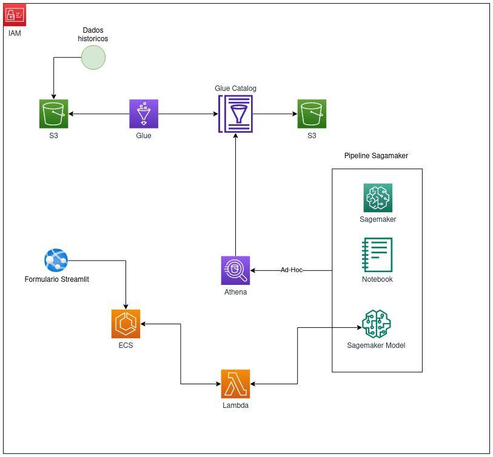
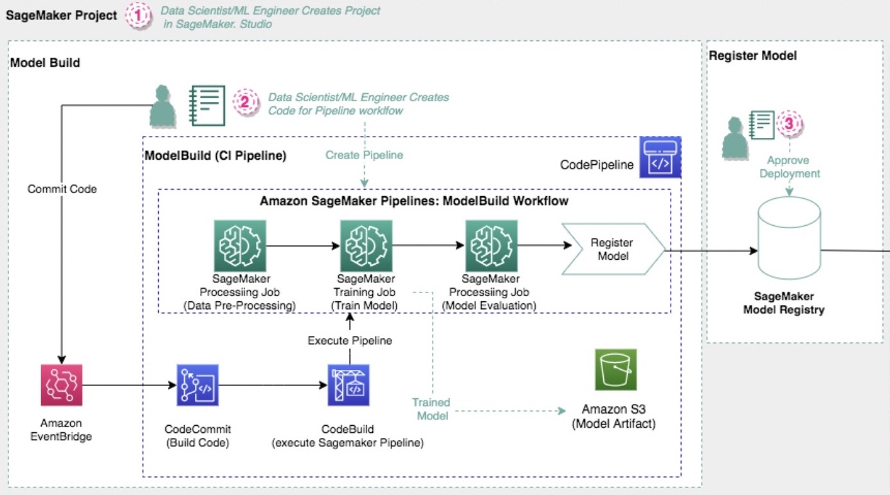
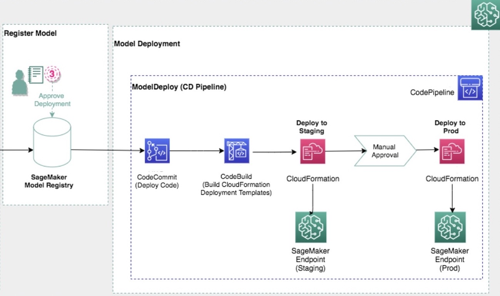
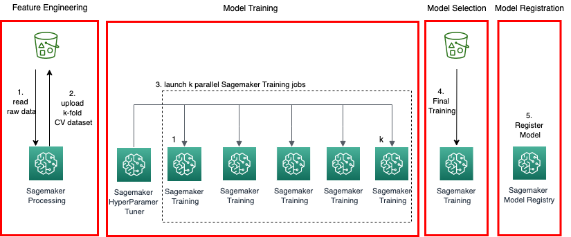

# Respiratory Classification

## 1. Business problem

This is an end-to-end data science project which predicts what kind of SARS virus a patient would have gotten. A XGBoost classification model was trained and deployed in AWS cloud using Sagemaker. The medical form used to fill patient information is avaliable on a web api on streamlit.

## 2. Business Assumptions
* In this first circle, It was used a balanced subset of the dataset that were randomly sampled.
* The patient who did not fill its gender (they were identified with 'I' in gender column) was removed from the data. 
* The data which were filled wrongly (such as values out of ranges) were replaced with feature mode.
* The NAs were filled with the mode

## 3. Dataset
The dataset contains approximately 700,000 rows and 76 features of patients that went to brazilian hospitals when they got sick with SARS virus symptoms. These features are about their demographic information, symptoms when they arrived at hospital, results of exams (Torax Ray X, tomographies), their vaccine schedule and other conditions (diabetes, obesity). Response variable is "CLASSI_FIN", which represents what SARS virus a patient got. The patients were diagnosed with one of the following labels:

1-SARS by influenza \
2-SARS by other respiratory virus \
3-SARS by other etiological agent \
4-SARS unspecified \
5-SARS by covid-19

The data dictionary is inside the jupyter notebook.

## 4. Tools used

* Python
* Jupyter notebook
* Git and Github
* AWS Sagemaker
* AWS Cloud
* Streamlit
* Docker
* Sklearn

## 5. Planning Soluction

This project was developed based on CRISP-DM (Cross-Industry Standard Process - Data Science) framework but with additional steps, especially in deployment. This framework has these steps:

Step 1. Create an AWS crawler to retrieve metadata of the dataset stored in a S3 bucket and insert this metadata in AWS Glue catalog \
Step 2. Use AWS athena to query the data in S3 and save the raw, train and test data in s3 bucket \
Step 3. Data description and cleaning: Seeing dimensions of data, checking existence of NAs, number of rows and columns.Descriptive statistics. Fillout NAs, outlier analysis and replacing values \
Step 4. Feature selection to remove unimportant features \
Step 5. Create a project in Sagemaker Studio Classic using MLOps template for model building, training and deployment \
Step 6. Create the python scripts that will be used in the Pipeline steps along with their docker images
Step 7. Creation of pipeline and its step (Preprocessing CV Step, Hyperparameter Tuning Step, Preprocessing step, Model training Step, Register Model Step and Condition Step) \
Step 8. Commit the pipeline to trigger the running of the Pipeline (CodePipeline) \
Step 9. After creation and registration of the model in model registry. Manually approve it in the sagemaker studio classic to trigger the deployment of the model in CodeBuild (build CloudFormation deployment template) to deploy the model in a staging endpoint \
Step 10. Manually approve the staging endpoint to trigger the model deployment in the production endpoint \
Step 11. Creation and running of the lambda function using a docker image \
Step 12. Creation and deployment of medical form on streamlit web using ECS service

## 6. Project Architecture

The architecture of the project is shown below:

The historical data is in a S3 bucket and an AWS Glue Crawler was created to catalog this data. Then, it was used Athena to query the data inside notebook sagemaker. The pipeline and model was developed. The model was deployed using the CloudFormation. The medical form was deployed in a web app using streamlit in a ECS server. This ECS server was running using a docker image registered in ECR. The medical form send the patient information using an HTTP request to a lambda function. This lambda function receives data in a JSON format, process it by transforming the data applying the same encoders and transformations used in train data and send this transformed data to model endpoint. The model predicts what SARS virus patient would has and send back to the lambda endpoint which then send back to the website.

The Sagemaker Data Science project template for model building, training and deployment (MLOps) is divided in two steps: Model build and model deployment. The model build is shown below:

When you commit the pipeline code in Sagemaker Studio Classic in CodeCommit, it triggers an Amazon EventBridge that starts code building in Codebuild. Codebuild runs CodePipeline that is the training pipeline. If the model trained meets the Condition Step (for instance, if the F1 score of the model is higher than 0.5), the model will be registered in model registry and its artifact is stored in S3.

After you manually approve the trained model, it starts the model deployment. The model deployment infrastructure is shown below:

CodeBuild runs the code to build and deploy the model in staging area. The deployment is handled by CloudFormation, which takes care of the infrastructure needed to create the inference endpoint with trained model. When everything is all set in staging endpoint, a manual approval is necessary to moving forward and deploy the model to production. Finally, a model endpoint is avaliable in production for predictions.

## 7. Machine Learning Model Applied and performance

The model applied in the first circle was an XGBoost. To train a generalized model it was applied a k-fold cross-validation to avoid underfitting or overfitting. This cross-validation also was used to do a hyperparameter tuning. The architecture of Hyperparameter Tuner step is shown below:

The metric used to check performance was F1 score. The metric of the first model was 53.81%. It was a reasonable score for the first MLOps circle, since this is the baseline score.

## 8. Web Application

The medical form and its working is shown below. It is possible to see the output of the model and the classification of the virus based on patient information and exams.

## 9. Next steps

Possible adjustments and improvements in the second circle could be the following:

* Include other features in final model and using different feature selection method to improve the F1 score baseline
* Test other Algorithms like Random Forest, LightGBM and SVM
* Use another approach for dealing with NAs, such as removing them instead of replacing their values
* Use all historical data to train the model.